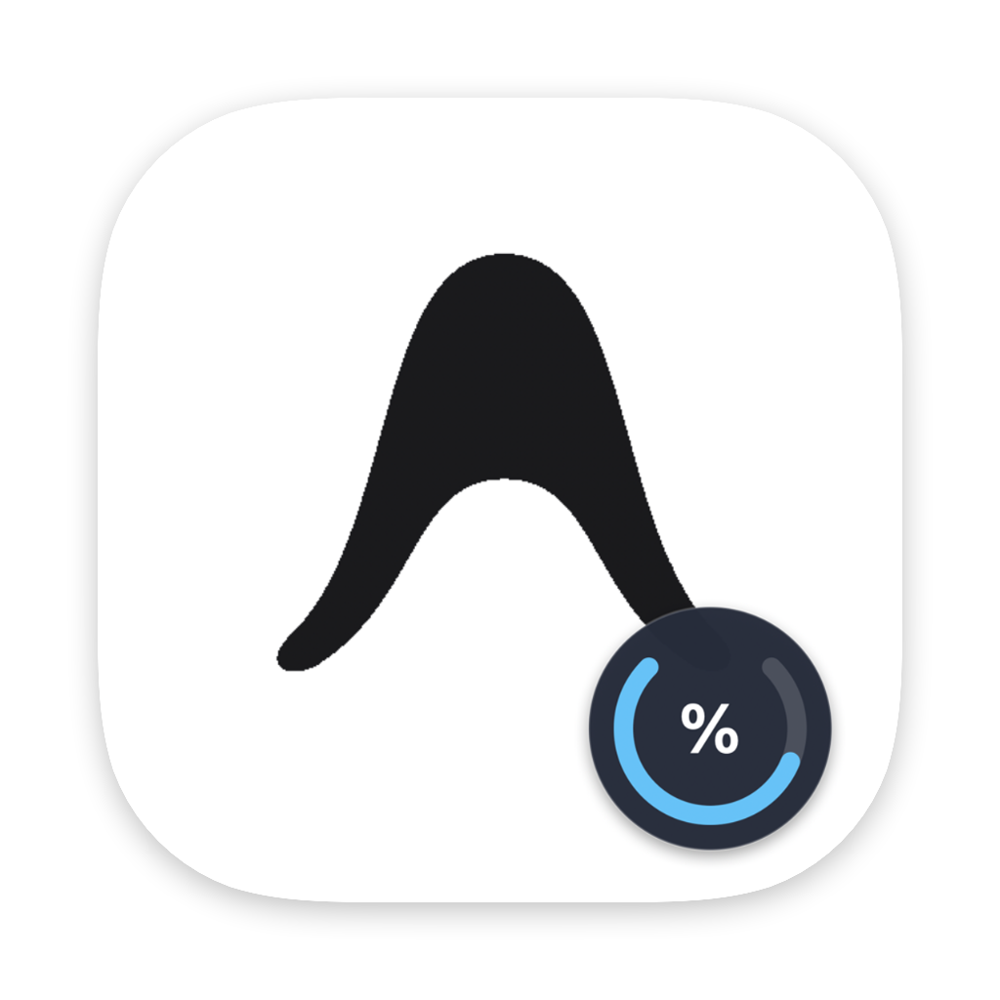
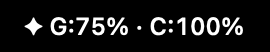
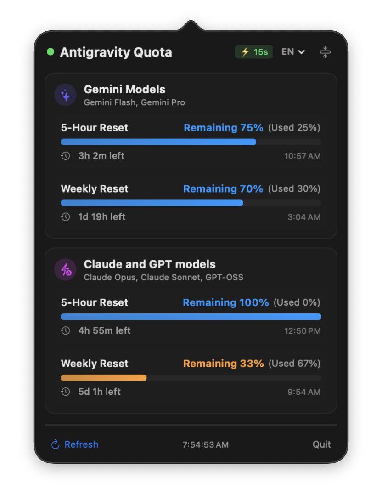
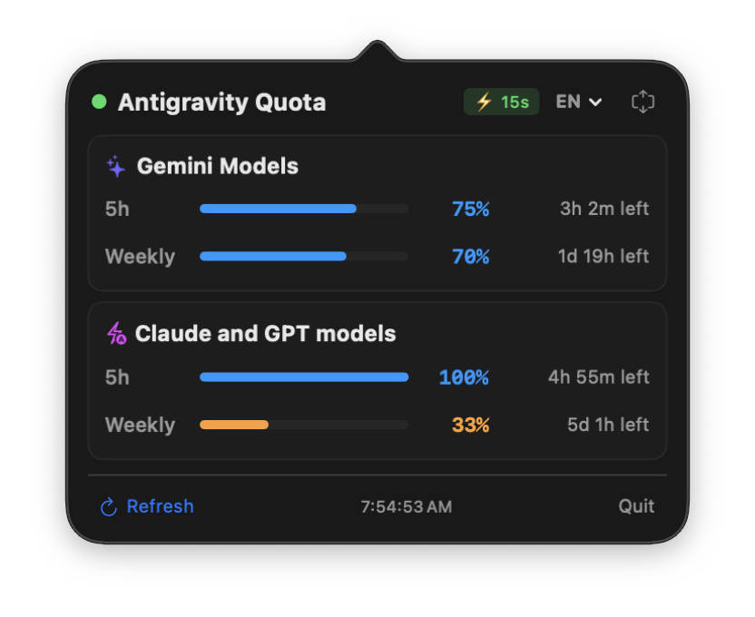
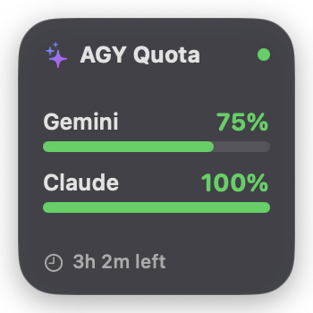
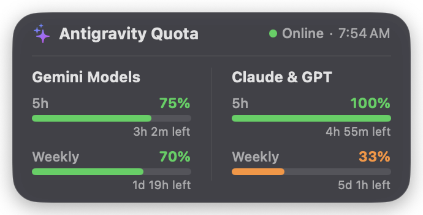

# Antigravity Quota

<p align="center">
  
</p>

<p align="center">
  <strong>A lightweight, real-time macOS menu bar quota monitor & WidgetKit widgets for Google Antigravity.</strong><br>
  <em>Track Gemini, Claude, and GPT model limits, remaining reset timers, and usage percentages directly from your status bar, desktop, and Notification Center.</em>
</p>

<p align="center">
  
  
  
  
  
</p>

---

> [!NOTE]
> **🤖 100% Built with Google Antigravity**
>
> This entire application—including local RPC discovery, architecture, SwiftUI views, WidgetKit extensions, adaptive polling logic, multi-language localization, icon design, and build tooling—was **100% designed, implemented, and verified pair-programming autonomously with Google Antigravity**.

---

## Screenshots

<p align="center">
  
  <br>
  <em>Status Bar Quota Summary</em>
</p>

<p align="center">
  
  &nbsp;&nbsp;&nbsp;&nbsp;
  
  <br>
  <em>Menu Bar Popover: Standard Mode (Left) &nbsp;|&nbsp; Compact Mode (Right)</em>
</p>

<p align="center">
  
  &nbsp;&nbsp;&nbsp;&nbsp;
  
  <br>
  <em>macOS Widgets: Small 1x1 (Left) &nbsp;|&nbsp; Medium 1x2 (Right)</em>
</p>

---

## Features

- **Real-Time Quota Monitoring**:
  - Displays remaining percentages and usage for both **Gemini Models** and **Claude / GPT Models**.
  - Monitors both **5-Hour rolling limits** and **Weekly quota limits**.
- **macOS Desktop & Notification Center Widgets (WidgetKit)**:
  - **Small Widget (`systemSmall` / 1x1)**: Minimalist overview with Gemini and Claude quota progress bars, remaining %, online indicator, and shortest reset countdown.
  - **Medium Widget (`systemMedium` / 1x2)**: Two-column card comparing Gemini and Claude/GPT side-by-side with 5-Hour and Weekly limits, countdown clocks, and live status badge.
  - **Native Frosted Glass Material**: Styled with `.regularMaterial` and borderless integration (`.contentMarginsDisabled()`) to seamlessly match macOS system widgets and wallpaper tinting in both Dark and Light modes.
  - Real-time synchronization powered by `QuotaDataStore` and instant `WidgetCenter.reloadAllTimelines()` triggers whenever quota updates.
  - Fully supports macOS Dark Mode and all 7 localized languages.
- **Live Countdown Clocks**:
  - 1-second interval live countdown clocks showing exact time until the next quota replenishment (e.g., `4h 52m left`, `1d 20h left`).
- **Adaptive Smart Polling**:
  - **15-Second AI Burst Polling**: When AI activity (token generation, tool calling) causes quota to decrease, polling automatically accelerates to 15s for 3 minutes to provide real-time updates while you work (even if Antigravity is in the background).
  - **60-Second Idle Polling**: When no AI quota consumption occurs, polling automatically steps down to 60s to conserve battery and CPU.
  - **Instant Focus Refresh**: Switching to the Antigravity window triggers an immediate sync to catch new changes on demand.
  - **Automatic Pause**: Polling gracefully pauses when Antigravity is quit or offline (`⏸️`), resuming instantly when re-launched.
- **Remote SSH Fallback (Multi-Machine Sync)**:
  - When working across multiple Macs where Antigravity is not actively running on the local machine, Antigravity Quota can seamlessly query your remote machine via SSH.
  - Fully configurable in **Settings > Remote**: enable toggle, target SSH host (supports `user@hostname` or `~/.ssh/config` aliases), configurable polling interval (30s, 1m, 2m, 5m), and built-in connection testing.
  - Executes direct remote RPC queries with zero lingering tunnel daemons, no external dependencies, and no file synchronization overhead.
- **Compact & Standard View Modes**:
  - **Standard Mode**: Detailed cards with visual progress gradients, percentages, and scheduled reset times.
  - **Compact Mode**: Ultra-slim, minimal view designed for zero scrolling and minimal screen real estate.
  - Seamlessly switch anytime with a single click or keyboard-accessible toggle (persisted across launches).
- **Multi-Language Support (7 Languages)**:
  - Supports **English**, **한국어 (Korean)**, **简体中文 (Simplified Chinese)**, **日本語 (Japanese)**, **Deutsch (German)**, **Français (French)**, and **Español (Spanish)**.
  - Automatically matches your macOS system language preference upon first launch.
  - 1-click dropdown menu to switch languages on the fly via the popover header.
  - All text, countdown timers, scheduled replenishment times, and "Last updated" timestamps are localized to the active language's locale.
- **Native macOS Experience**:
  - Built with 100% Swift & SwiftUI with AppKit integration.
  - Menu-bar-only daemon (`LSUIElement = true`) with zero Dock clutter.
  - Apple Human Interface Guidelines-compliant macOS squircle icon.
  - Dynamic popover positioning ensuring clean alignment directly beneath the status bar.
  - Pixel-perfect top/bottom padding and active visual effect vibrancy consistency across standard and compact view modes.
  - Zero external third-party dependencies—pure Swift Package Manager.

---

## How It Works

Antigravity runs an internal language server daemon (`language_server`) listening on an ephemeral local TCP port.

1. **Process & CSRF Token Extraction**:
   Inspects `/bin/ps` to locate the active `language_server` process and securely extracts the session `--csrf_token`.
2. **Instant Port Resolution**:
   Uses `/usr/sbin/netstat` to find active listening TCP sockets for the detected PID in sub-milliseconds without port scanning overhead.
3. **Connect-RPC Protocol**:
   Sends HTTP POST requests to `http://127.0.0.1:<port>/exa.language_server_pb.LanguageServerService/RetrieveUserQuotaSummary` with authentication header `x-codeium-csrf-token`.
4. **Shared Data Store & Widget Sync**:
   Writes the latest quota snapshot to the shared suite container and calls `WidgetCenter.shared.reloadAllTimelines()` so widgets reflect fresh numbers instantly.
5. **Reactive Presentation**:
   Parses `remainingFraction` and `resetTime` into strongly typed Swift models and renders them seamlessly via SwiftUI, `NSStatusItem`, and WidgetKit.

---

## Adding Widgets to macOS

1. Build and install the app to `/Applications` using `./scripts/build_app.sh`.
2. Right-click on your macOS desktop and choose **Edit Widgets...** (or open **Notification Center** and click **Edit Widgets** at the bottom).
3. Search for **Antigravity Quota** in the widget gallery.
4. Choose either the **Small (1x1)** or **Medium (1x2)** widget and drag it onto your desktop or Notification Center.

---

## System Requirements

- **macOS**: 13.0 (Ventura) or higher.
- **Hardware**: Apple Silicon (M1/M2/M3/M4) or Intel Mac.
- **Antigravity**: Google Antigravity installed.
- **Development Tool**: Xcode 15.0+ or Swift 5.9+ toolchain (only if compiling from source).

---

## Installation & Building

### 1. Download Pre-built App (DMG)

Download the latest disk image from [GitHub Releases](https://github.com/badugisoft/antigravity-quota/releases):

1. Download **`Antigravity-Quota-<version>.dmg`** and open it.
2. Drag **Antigravity Quota.app** into your **Applications** folder.
3. **First-Time Launch (Gatekeeper)**:
   - Since this open-source build is distributed with ad-hoc signing, macOS may show an unverified developer prompt.
   - **Right-click** `Antigravity Quota.app` in `/Applications` and click **Open**, then confirm with **Open**.
   - Or run in Terminal:
     ```bash
     xattr -cr "/Applications/Antigravity Quota.app"
     ```

### 2. Build and Install via Script from Source

Run the included automated build script from the repository root:

```bash
git clone https://github.com/badugisoft/antigravity-quota.git
cd antigravity-quota
./scripts/build_app.sh
```

The script will:

1. Compile all targets in `Release` mode (`swift build -c release`).
2. Package the main app (`Antigravity Quota.app`) and embed the WidgetKit extension (`Contents/PlugIns/AntigravityQuotaWidget.appex`).
3. Embed high-resolution icons (`AppIcon.icns`) and configure `Info.plist` with `LSUIElement=true`.
4. Ad-hoc codesign both the extension and the main application bundle.
5. Install it directly into `/Applications/Antigravity Quota.app`.
6. Launch the menu bar app automatically.

### 2. Manual Build with SwiftPM

```bash
swift build -c release
```

The executables will be generated at `.build/release/AntigravityQuota` and `.build/release/AntigravityQuotaWidgetExtension`.

---

## Running at Login (Optional)

To have Antigravity Quota start automatically when your Mac boots:

1. Open **System Settings** on your Mac.
2. Navigate to **General** > **Login Items**.
3. Under **Open at Login**, click the **+** button.
4. Select `/Applications/Antigravity Quota.app` and click **Open**.

---

## Project Structure

```
antigravity-quota/
├── .github/
│   └── workflows/
│       └── release.yml                       # GitHub Actions CI/CD release workflow
├── Package.swift                             # SwiftPM multi-target configuration
├── LICENSE                                   # MIT License
├── README.md                                 # English documentation
├── AGENTS.md                                 # Guidelines for AI agents & contributors
├── assets/                                   # Documentation screenshots and preview assets
│   ├── menubar_summary.png                   # Status bar snapshot
│   ├── popover_standard.png                  # Standard mode popover
│   ├── popover_compact.png                   # Compact mode popover
│   ├── widget_small.png                      # Small 1x1 macOS widget
│   ├── widget_medium.png                     # Medium 1x2 macOS widget
│   └── app_icon.png                          # 512x512 app icon
├── scripts/
│   ├── build_app.sh                          # App & WidgetKit extension build script
│   ├── package_release.sh                    # Automated .dmg and .zip release packager
│   └── entitlements/                         # macOS App Sandbox & group entitlements
│       ├── app.entitlements                  # Host app entitlements
│       └── widget.entitlements               # Sandboxed widget extension entitlements
├── Sources/
│   ├── AntigravityQuotaCore/                 # Shared core library
│   │   ├── Models/
│   │   │   ├── QuotaModel.swift              # Quota data models & time formatting
│   │   │   └── QuotaSnapshot.swift           # Snapshot representation for widgets
│   │   ├── Services/
│   │   │   ├── QuotaDataStore.swift          # Shared Suite & file synchronization
│   │   │   ├── LocalizationManager.swift     # Multi-language manager & dispatcher
│   │   │   └── Localization/                 # 7 supported language dictionaries
│   │   └── Views/
│   │       ├── SmallQuotaWidgetView.swift    # Small (1x1) widget layout
│   │       ├── MediumQuotaWidgetView.swift   # Medium (1x2) widget layout
│   │       └── WidgetBackgroundModifier.swift# Cross-version widget background
│   ├── AntigravityQuota/                     # Menu bar application
│   │   ├── main.swift                        # App entrypoint
│   │   ├── App/
│   │   │   └── AppDelegate.swift             # NSStatusItem & NSPopover lifecycle
│   │   ├── Services/
│   │   │   ├── LanguageServerDiscovery.swift # Process PID, CSRF, & port discovery
│   │   │   └── QuotaService.swift            # Connect-RPC client
│   │   ├── ViewModels/
│   │   │   └── QuotaViewModel.swift          # Main ViewModel & adaptive timers
│   │   ├── Views/
│   │   │   ├── MenuBarPopoverView.swift      # Popover root view & header controls
│   │   │   ├── QuotaGroupCardView.swift      # Standard mode card
│   │   │   ├── QuotaBucketRowView.swift      # Standard mode bucket row
│   │   │   ├── QuotaGroupCompactCardView.swift # Compact mode card
│   │   │   └── QuotaBucketCompactRowView.swift # Compact mode bucket row
│   │   └── Resources/
│   │       └── AppIcon.icns                  # macOS Big Sur+ HIG squircle icon
│   └── AntigravityQuotaWidget/               # WidgetKit extension bundle
│       ├── AntigravityQuotaWidgetBundle.swift# @main WidgetBundle definition
│       └── QuotaTimelineProvider.swift       # WidgetKit TimelineProvider
└── Tests/
    └── AntigravityQuotaTests/
        ├── QuotaModelTests.swift             # Models, localization & widget rendering tests
        └── QuotaServiceIntegrationTests.swift# Live RPC discovery integration test
```

---

## License

This project is licensed under the **MIT License** - see the [LICENSE](LICENSE) file for details.

---

<p align="center">
  Crafted with ❤️ by BadugiSoft & Google Antigravity.
</p>
